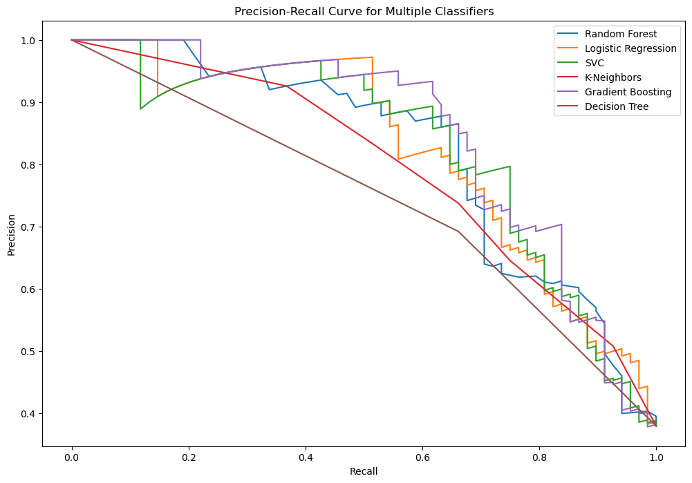

# Titanic Survival Prediction

## Project Overview
---
This project involves predicting passenger survival on the Titanic using machine learning. The workflow includes loading data, visualizing key statistics, preprocessing data with custom transformers, training various classifiers, and evaluating their performance. A GradientBoosting model is fine-tuned with GridSearchCV for improved accuracy, and predictions are made for a test dataset and saved for future use.

## Dataset
---
The dataset is provided by the `Kaggle` library. You can download it from here: "https://www.kaggle.com/c/titanic/overview"

### Correlation Analysis

## Data Visualization
---
### Age Distribution

### Sex Distribution

### Survival Rate by Sex

### Survival Rate by Passenger Classes

## Models Used
---
    RandomForestClassifier
    LogisticRegression
    SVC
    KNeighborsClassifier
    GradientBoostingClassifier
    DecisionTreeClassifier

## Results
---
### Model Accuracies

### Confusion matrix for each model

### Precision-Recall Curves

## Conclusion
---
This project involves predicting passenger survival on the Titanic using machine learning. Key steps, from data preprocessing to model optimization, were crucial in enhancing predictive accuracy. The final model demonstrated the project's potential to make informed predictions, reflecting the importance of a structured approach in data science. This work illustrates the iterative nature of developing robust predictive models and the critical role of hyperparameter tuning in refining model performance.

I hope you find it useful. Please let me know if you have any feedback or questions. Thank you!
